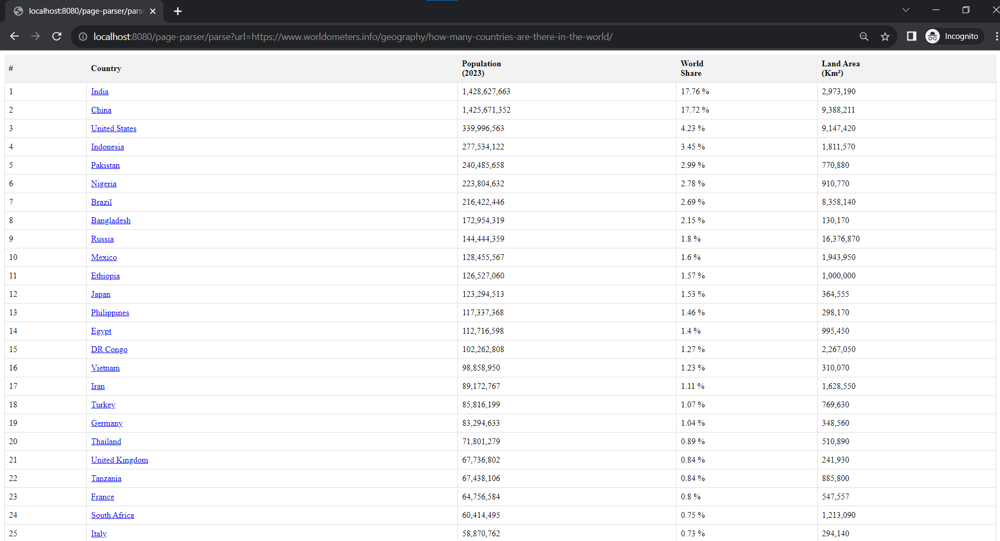

# Spring Boot HTML Parser

## Table of Contents

- Features
- Prerequisites
- Getting Started
- Usage
- API Endpoints
- Examples

---

## Features

- Fetches an HTML page from a specified URL.
- Parses the HTML content to extract tables.
- Provides REST API endpoint to retrieve tables from the HTML page.

---

## Prerequisites

Before you begin, ensure you have met the following requirements:

- **Java Development Kit (JDK)**: Ensure you have Java 11 or higher installed on your system.
- **Apache Maven**: Make sure you have Maven installed for building and managing the project.
- **Spring Boot**: This project is based on Spring Boot.

---

## Getting Started

To get started with this project, follow these steps:

1. Clone the repository to your local machine:

   ```shell
   git clone https://github.com/AliezkaN/page-table-parser.git
   ```
   
2. Navigate to the project directory:

   ```shell
   cd page-parser
   ```
   
3. Build the project using Maven:

   ```shell
   mvn clean install
   ```
---

## Usage

Start the Spring Boot application:

   ```shell
   mvn spring-boot:run
   ```

The application will run on `http://localhost:8080`

---

## API Endpoints

- **GET /page-parser/parse**: Fetches and parses the HTML page to extract tables.
    - Parameters:
        - url. (**required**)
        - singleTable - (true|false) used to fetch single table or multiple tables. By default false 
    - Response:
        - html tables.
---

## Examples

To retrieve an HTML page from a specific URL, open your web browser and enter the following URL in the address bar:

- http://localhost:8080/page-parser/parse?url=https://www.worldometers.info/geography/how-many-countries-are-there-in-the-world/
